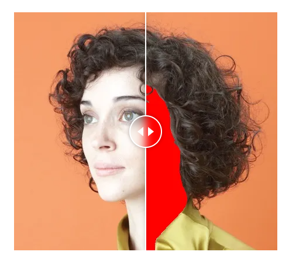

[thesis]: https://github.com/123mpozzi/skin-detection-thesis "Human Skin Detection In Color Images"

# Human Skin Detection in Color Images

<div align="center">
  
</div>
<br>

Overview of my [Bachelor thesis][thesis].  

The purpose of the thesis is to present a review of the human skin detection datasets and approaches of the state of the art, and then perform a comparative in-depth analysis of the most relevant methods on different databases.

#### Abstract

<p align="justify">
Skin detection is the process of discriminating skin and non-skin pixels in an arbitrary
image and represents an intermediate step in several image processing tasks, such as facial analysis and biomedical segmentation. Different approaches have been presented in
the literature, but a comparison is diffcult to perform due to multiple datasets and varying performance measurements. In this work, the datasets and the state-of-the-art approaches are reviewed and categorized using a new proposed taxonomy. Three different
representative skin detector methods of the state of the art are selected and thoroughly
analyzed. This approaches are then evaluated on three different state of the art datasets
and skin tones sub-datasets using multiple metrics. The evaluation is performed on single
and cross dataset scenario to highlight key differences between methods, reporting also
the inference time. Finally, the results are organized into multiple tables, using the related
figures as an assistance tool to support the discussion. Experimental results demonstrate
the strength and weaknesses of each approach, and the need to involve multiple metrics
for a fair assessment of the method’s aspects.
</p>

## Setup

This website is built using [Docusaurus 2](https://docusaurus.io/), a modern static website generator.

#### Installation

```
$ yarn
```

#### Local Development

```
$ yarn start
```

This command starts a local development server and opens up a browser window. Most changes are reflected live without having to restart the server.

#### Build

```
$ yarn build
```

This command generates static content into the `build` directory and can be served using any static contents hosting service.

#### Deployment

Using SSH:

```
$ USE_SSH=true yarn deploy
```

Not using SSH:

```
$ GIT_USER=<Your GitHub username> yarn deploy
```

If you are using GitHub pages for hosting, this command is a convenient way to build the website and push to the `gh-pages` branch.
